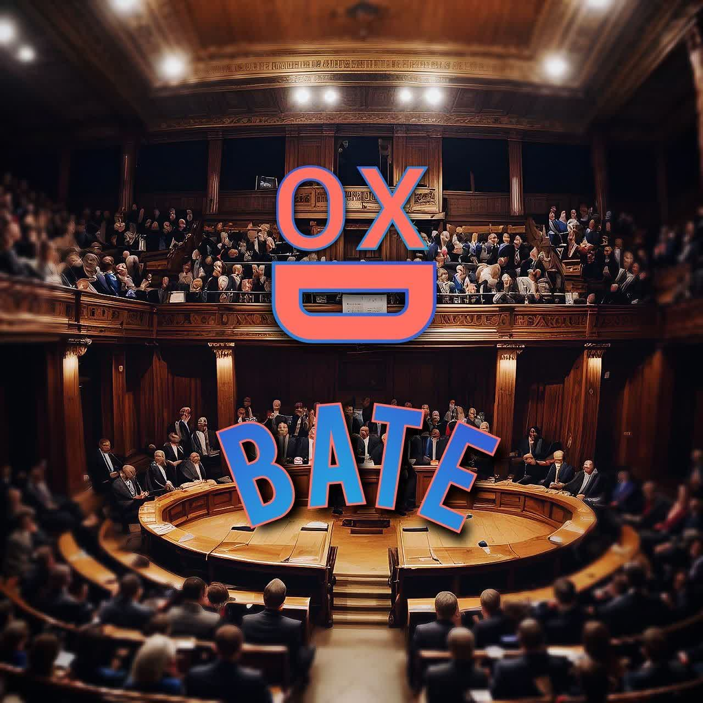

# OXDebate Application


Welcome to the repository of our ChatGPT web application, a marriage between the power of artificial intelligence and the human-like interaction of a chat interface. This application employs an open-source GPT model, providing a conversational AI experience that allows us to answer follow-up questions, admit mistakes, challenge incorrect premises, and reject inappropriate requests.

Built using a combination of React, GoLang, and Python, this application represents a comprehensive full-stack solution. React is employed to create a user-friendly and interactive front-end, GoLang handles server-side operations, and Python manages the GPT model server.

In the initial stages of the project, the plan was to use OpenAI's API. However, to overcome certain limitations and to provide a more flexible solution, the decision was made to switch to an open-source GPT model. The result is an application that is capable of handling real-time chat with the GPT model, offering a dynamic and engaging user experience.

Whether you're a developer interested in the mechanics of integrating a GPT model into a full-stack application, or a user fascinated by the capabilities of AI in chat interfaces, we welcome you to explore this project further.
## demo


## Built With


 

React - goLang - python

## Setup Introduction
To set up the repository on your local machine, follow these steps carefully:

### Cloning the repository
Clone the repository to your local machine using the following command:
```bash
git clone https://github.com/seyed0123/OXDebate.git
```

### Backend Setup
Navigate to the server directory and install the backend dependencies:
```golang
export GO111MODULE="on"
go mod tidy
go run src/main.go
```

### Frontend Setup
Navigate to the client directory, install the frontend dependencies and start the front-end server:

```bash
cd front
npm install
npm start
```
### GPT Model Server Setup
run the `gpt.ipynb` file that is installing the packages and starting the server.

GPT 4 model is used from this [repo](https://github.com/xtekky/gpt4free) and thanks for their collaborator's  hard work 

## Usage
Type in the input field and click on the send button to interact with the GPT model. The responses are displayed in the webpage.

## Contributing
Contributions, issues, and feature requests are welcome! Feel free to check the issues page. Don't hesitate to drop any suggestions or improvements you have in mind.

## License
Distributed under the MIT License. See [LICENSE](LICENSE) for more information.

# shots:


